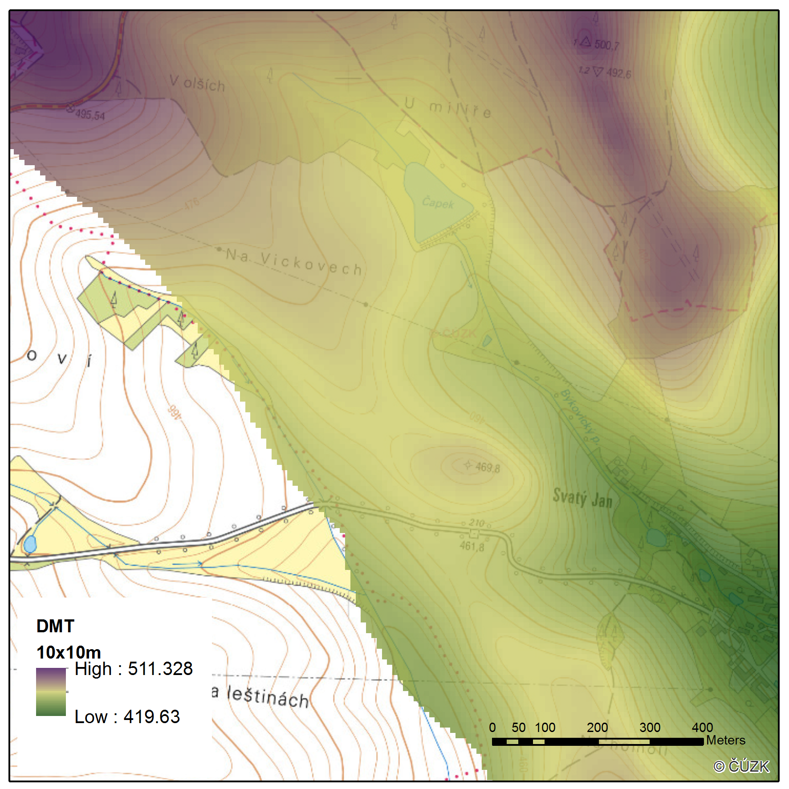
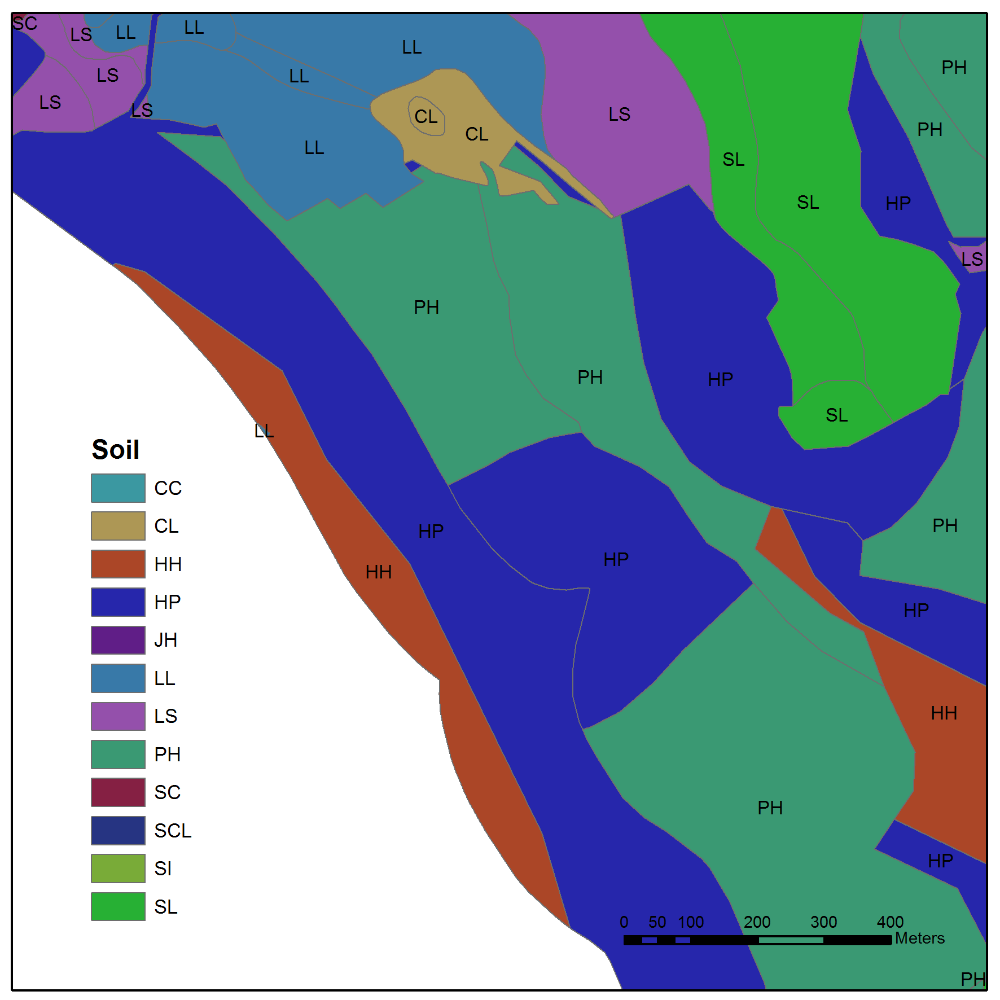
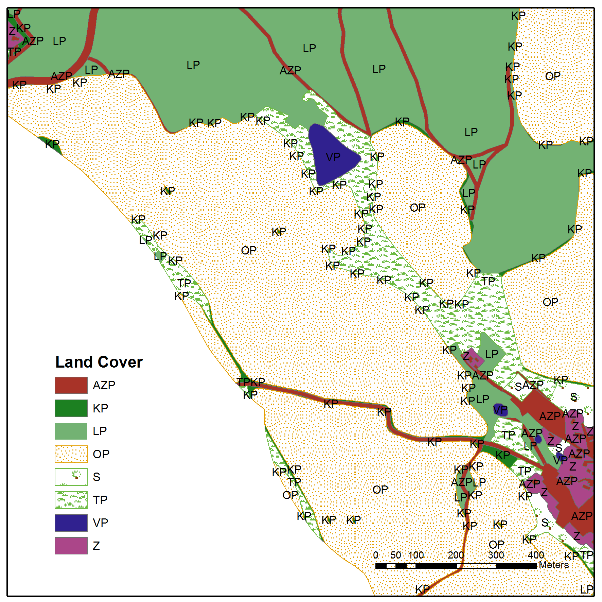

# SMODERP2D - Distributed event-based model for surface and subsurface runoff and erosion

Welcome to the user guide for the SMODERP2D model. The aim of this text is
to provide basic information to users on how to run the SMODERP2D model.

```sh
    @ @ @   @       @     @ @     @ @ @     @ @ @ @  @ @ @    @ @ @
   @        @ @   @ @   @     @   @     @   @        @     @  @     @
   @        @   @   @  @       @  @      @  @        @     @  @     @
     @ @    @       @  @       @  @      @  @ @ @    @ @ @    @ @ @
         @  @       @  @       @  @      @  @        @   @    @
         @  @       @   @     @   @     @   @        @    @   @
    @ @ @   @       @     @ @     @ @ @     @ @ @ @  @     @  @
    \  \  /   / /    \   \  /   \  /    /     /       @ @ @   @ @ @
     \ _\/   /_/      \   \/     \/    /_____/       @     @  @     @
         \__/          \  /      _\___/                    @  @      @
             \____      \/      /                         @   @      @
                  \_____/______/                        @     @      @
                               \                      @       @     @
                                \___________________ @ @ @ @  @ @ @
```

The SMODERP2D model is designed to calculate hydrological and erosion processes on
individual plots or small catchments. The outputs of the model are primarily
used to determine runoff conditions in a catchment and obtain parameters for
runoff and erosion risk protection measures on agricultural land. Additionally,
the model can assist in designing more complex systems, including sediment
retention ponds, dry basins, or polders. Its use complies with current
methods, technical standards, and recommended practices.

The SMODERP2D model is open source project developed by the Department
of Landscape Water Conservation, Faculty of Civil Engineering, Czech
Technical University in Prague. Source code is licenced under GNU GPL
and available from GitHub repository <https://github.com/storm-fsv-cvut/smoderp2d>.

## GIS providers

SMODERP2D model relies on a GIS software were the input and output
data can be acquired, modified and visualized. Currently, SMODERP2D
supports three GIS solutions:

- [QGIS](qgis.md)

- [GRASS GIS](grass.md)

- [ArcGIS](arcgis.md)

## Installation instructions

See specific instructions for
[QGIS](qgis.md#installation-instructions), [GRASS
GIS](grass.md#installation-instructions) and [ArcGIS
Pro](arcgis.md#installation-instructions) for details.

In case you will run SMODERP2D without the above mentioned GIS
solutions, the recommended installation procedure is based on PyPI: <https://pypi.org/project/smoderp2d/>

```sh
pip install smoderp2d
```

## Input data

The model incorporates information about the area's topography, soil types and
land use spatial distribution, rainfall, and, where applicable, the geometry of
hydrographic network. 

### Digital elevation model (Compulsory)

A digital elevation model (DEM) or digital terrain model (DTM) **raster**
represents the morphology of the modelled area. Each cell in the raster contains 
information about the land elevation.

The model numerical scheme spatial discrimination is inherited from the DEM
layer cell size. The cell size can vary depending on the size of the modelled
area. For the SMODERP2D model the minimum cell size should be 2 meters, with an
optimum of 5 meters or more.



### Soil type  map (Compulsory)

**Vector** layer with polygons indicating the spatial distribution of soil
types. 

The figure shows a example of soil map layer. The attribute table of the layer
must include field with soil type identifier. These identifiers correspond to
soil characteristics, which are stored in a separate table (see below).
Physical meanings of these parameters and their implementation in the model are
in detail described in the reference manual.

For instance, in Czechia soil type data from agricultural land can be obtain
via <https://kpp.vumop.cz>.




### Land use / Land cover (Compulsory)

Similar to soils in the previous section, the attribute table of the land use
vector layer requires supplementation with an identifier field for land use.
This identifier corresponds to the surface characteristics defined in a
separate table (see below).

Physical meanings of the land used parameters and their implementation in the
model are in detail described in the reference manual.




### Soil and landuse parameters table (Compulsory)

Another compulsory input is a table containing the values of individual soil
type and land cover parameters. 


This table is referenced by combinations of soil type and land use type
identifiers defined for each polygon in the attribute tables of the vector
inputs. In the example below, the first column contains parameters for the
combination of soil type `CA` and land cover `ZP`.


The table may be inserted into the model as a text file (.csv).  

The meanings of the individual parameters are described in reference manual.


{{ read_csv('tables/soil_veg_tab.csv', sep=';') }}

### Water course network (Optional)

### Points of interest (Optional)

## Model settings

- total and max dt
- output directory
- extra output
- D8/mfda
- kinematic/diffuse


## Outputs

Lorem ipsum dolor sit amet, consectetur adipiscing elit. Duis vehicula tempus
nunc a vulputate. Cras mauris ligula, ultrices facilisis diam quis, condimentum
convallis magna. Duis bibendum sapien ac mi tristique volutpat. Morbi dolor mi,
commodo consectetur ligula id, laoreet porttitor sapien. Nam aliquet posuere ex
eget tincidunt. Praesent vehicula erat lorem. Pellentesque habitant morbi
tristique senectus et netus et malesuada fames ac turpis egestas. Aenean sit
amet elit ac velit placerat blandit dictum faucibus massa. Integer sed dui
lectus. Aenean non fermentum enim, sed molestie diam. Cras mollis euismod arcu.
Ut eu elit et eros aliquet elementum. Aenean semper, augue quis tempus dapibus,
felis ligula sodales justo, sit amet vulputate turpis velit a lorem. Morbi
auctor dignissim tincidunt. In hac habitasse platea dictumst. Morbi rhoncus
imperdiet purus quis scelerisque.

Suspendisse et pulvinar nisi. Nulla bibendum dapibus neque eu vehicula. Aliquam
erat volutpat. Suspendisse condimentum risus vitae justo porta rutrum. Nam
rhoncus interdum dolor, id rutrum sem posuere vitae. Morbi tempus metus at
semper hendrerit. Suspendisse potenti. Quisque id velit venenatis, venenatis
tortor vitae, pellentesque augue. Maecenas pretium ligula sed eros semper, sed
viverra mauris finibus. Nullam eu neque in libero eleifend lacinia.

- [PK_test](PK_structure.md)
