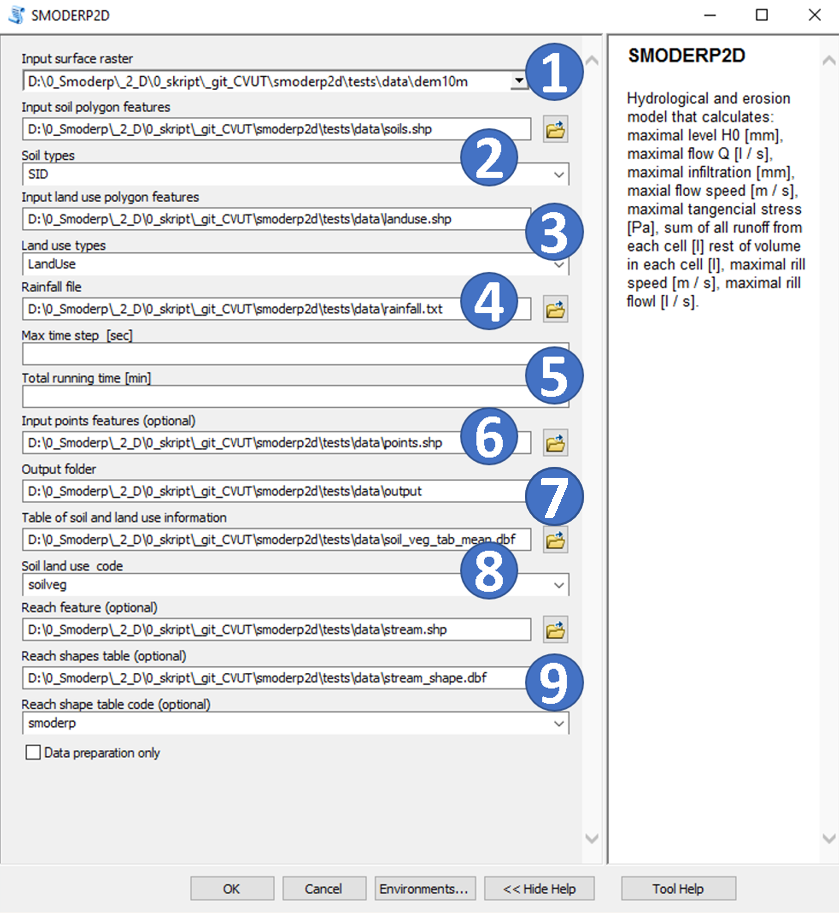

# Input data
Input data are divided to two groups a) for surface runoff processes and b) stream flow
Inputes are describe in goups (see the picture).
.
Data types of inputes data are descrime in table ** link to the tabel**

## Ranfall data (4)
The next input is a file containing rainfall data. The rainfall is entered as a *.txt (text file) with two columns. The left column is the time interval in minutes, the right column is the cumulative rain from simulation start in millimetres. Real measured or design precipitation data can be used in model.
For instance, in Czechia design precipitation can be obtain via web map services <https://rain.fsv.cvut.cz>.

## Surface flow

The inputes to the model incorporates information about the area's topography, soil types and
land use spatial distribution, rainfall for surface ruonoff processes, where applicable, the geometry of
hydrographic network for stream ruonff.

### Digital elevation model (Compulsory) (1)

A digital elevation model (DEM) or digital terrain model (DTM) **raster**
represents the morphology of the modelled area. Each cell in the raster contains 
information about the land elevation.

The model numerical scheme spatial discrimination is inherited from the DEM
layer cell size. The cell size can vary depending on the size of the modelled
area. For the SMODERP2D model the stabile computation  minimum cell size is recommended 2 meters, with an
optimum of 5 meters. Cell size with total area are crucial parameters for computing time (*see reference manual*).

### Soil characteristics map (Compulsory) (2)

**Vector (polygon)** layer with polygons indicating the spatial distribution of soil
types. 

The figure shows a example of soil map layer. The attribute table of the layer
must include field with soil type identifier. These identifiers correspond to
unique soil and land use characteristics, which are stored in a separate table (see below).
Physical meanings of these parameters and their implementation in the model are
in detail described in the reference manual.

For instance, in Czechia soil type data from agricultural land can be obtain
via <https://rain.fsv.cvut.cz/pudy>.

### Land use / Land cover (Compulsory) (3)

Similar to soils in the previous section, the attribute table of the land use
**vector layer (polygon) ** requires supplementation with an identifier field for land use.
These identifiers correspond to
unique soil and land use characteristics, defined in a separate table (see below).

Physical meanings of the land used parameters and their implementation in the
model are in detail described in the reference manual.

For instance, in Czechia soil type data from agricultural land can be obtain
from combination of ZABAGED and LPIS data.

### Soil and landuse parameters table (Compulsory) (8)

A crucial input for the model is a table that lists the values of model equations parameters (for detail see reference manual). This parameter table is linked to soil type and land use spatial data intersect assigned to each polygon in the vector input's attribute tables. Table as an external input, this attribute table enhances the model's transparency and allows users to modify the input data's characteristics to suit their specific needs.This table is referenced by combinations of soil type and land use type identifiers defined for each polygon in the attribute tables of the vector inputs. In the example below, the first column contains parameters for the combination of soil type `CA` and land cover `ZP`.

The table may be inserted into the model as a text file (.csv) or (better) as .dbf file.  

The meanings of the individual parameters are described in reference manual.

{{ read_csv('tables/soil_veg_tab.csv', sep=';') }}

<https://smoderp.fsv.cvut.cz/smoderp2d/data-a-vozorove-ulohy/> - tables for diffrent initial conditions.

## Stream flow (9)
Data for the watercoures are also divided to topology part and data table with unique characteristics of segments. Stream flow are calculated if the *watercourses shapes* are in the intercect cumputing domain and the relevat *water course table* are added to the model interface.

### Water course network (Optional)
**Vector (polyline)** layer with polylines indicating the thopology of watercourses and/or temporal ditches technical conservation measure).
The figure shows a example of water courses data. The attribute table of the layer
must include field with stream type. The watercourse network must be hydrologically correct. Individual end points of the watercourse network must have a different elevation taken from the DMR and at the same time bifurcation of the watercourse cannot be allowed.
These identifiers correspond to unique stream characteristics, which are stored in a separate table (see below).
Physical meanings of these parameters and their implementation in the model are
in detail described in the reference manual.

For instance, in Czechia stream shape data can be obtain from ZABAGED data.

### Water course table (Optional)

This table is referenced to unique stream types defined for each polygon in the attribute tables of the watercourse network
inputs. In the example below, the first column contains parameters ** channel_ID ** for unioque stream parts.
The table may be inserted into the model as a text file (.csv).  
The meanings of the individual parameters are described in reference manual.

{{ read_csv('tables/streams_shape.dbf') }}
## Other input's and model settings
### Points of interest (Optional)(6)
**Vector (point)** layer with point for detail outputs as hydrographs (describe in outpust). In this points are indicating the thopology of watercourses and/or temporal ditches technical conservation measure).
The monitored output data are continuously stored at these points. In the case of a point located outside the watercourse, surface runoff data are recorded. If the point is inserted into a watercourse, data are recorded for the relevant watercourse section.

### Model settins (5)
Checkboxes for types of computing (more information about model settings in next chapter)
