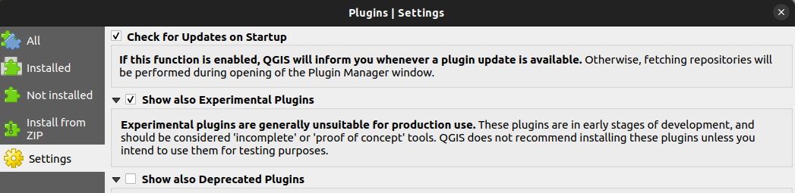
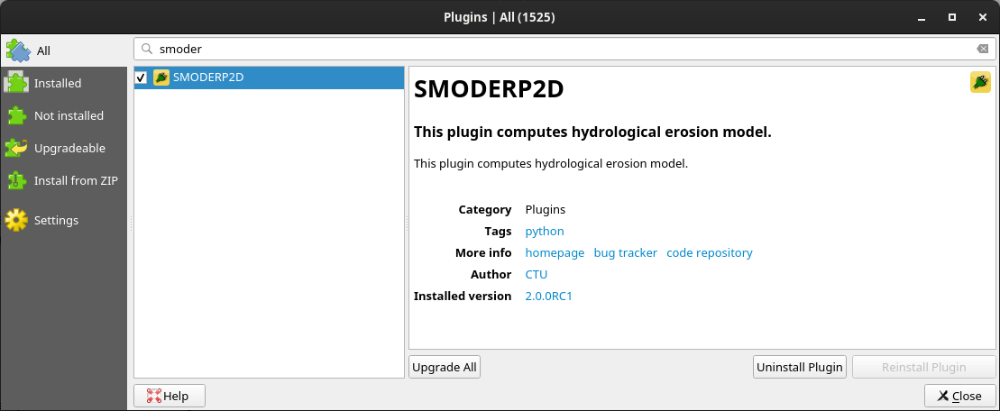
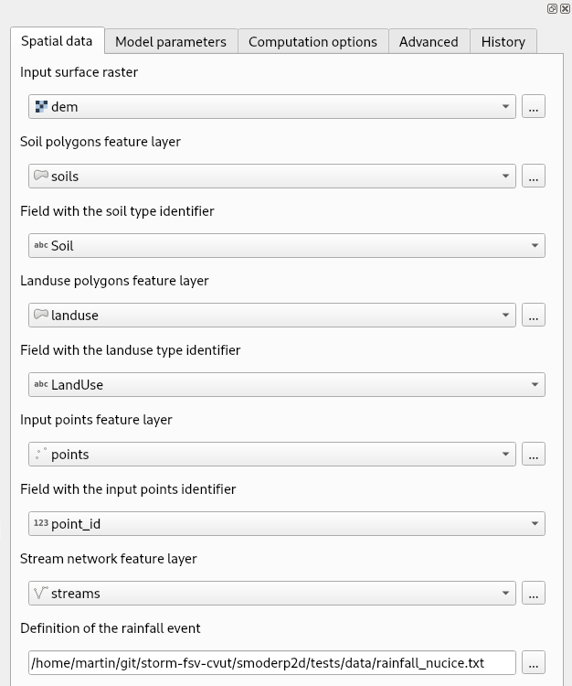
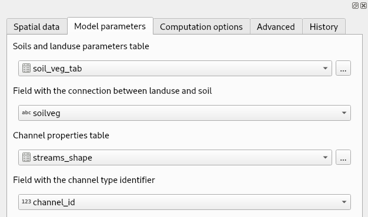
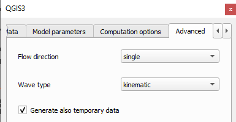
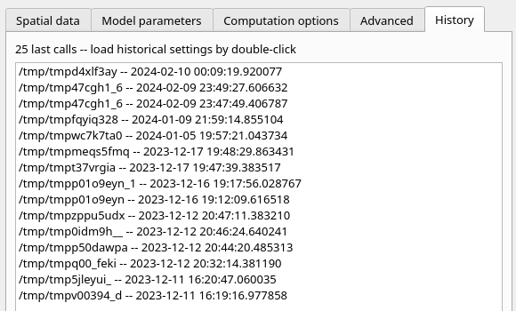
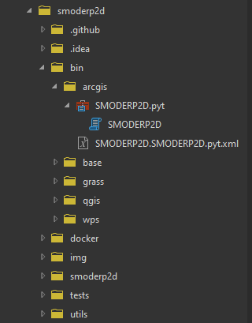
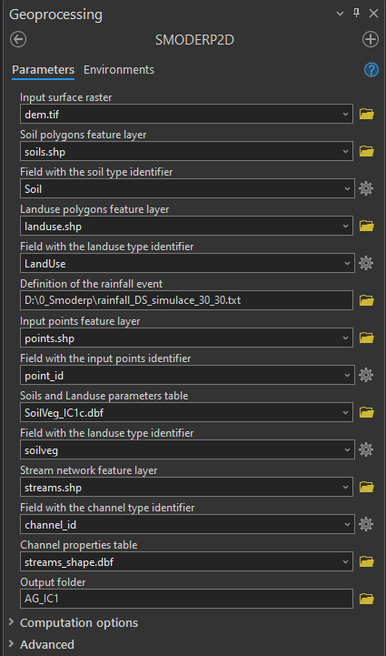
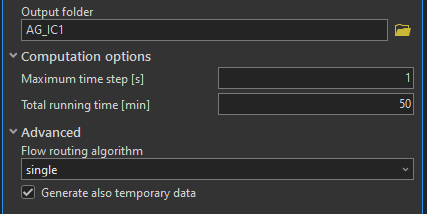

# Providers and install
SMODERP has been adapted to work seamlessly with various Geographic Information System (GIS) platforms. Instalation for QGIS, GRASS GIS, and ArcGIS is decribed here.

## QGIS - Plugin
In QGIS, the plugin repository is a central storage location where users can access and manage plugins that extend the functionality of the QGIS application. SMODERP are acessed from this repository.
### Installation instructions

* Install QGIS: <https://www.qgis.org/en/site/forusers/download.html>

* Check button "Show also Experimental Plugins" in Plugin/Settings 

* Install **SMODERP2D** plugin from QGIS plugin repository

Open the plugin from the menu ``Plugins`` ➤ ``SMODERP2D`` or from the
toolbar .

### Usage

## GRASS GIS Addon

### Installation instructions

* Install GRASS GIS: <https://grass.osgeo.org/download/>
* Download latest SMODERP2D version: <https://github.com/storm-fsv-cvut/smoderp2d/releases>
* Open GRASS Addon located in ``bin/grass/r.smoderp2d/r.smoderp2d.py``

## ArcGIS Pro - Toolbox
In the ArcGIS environment are a toolboxes a collection of geoprocessing tools. SMODERP are developed as extend tolbox of the ArcGIS software.

### Installation instructions

* Download ArcGIS Pro: <https://pro.arcgis.com/en/pro-app/latest/get-started/download-arcgis-pro.htm>
* Download latest SMODERP2D version: <https://github.com/storm-fsv-cvut/smoderp2d/releases>
* Open ArcGIS Toolbox located in ``bin\arcgis\SMODERP2D.pyt``

### Usage

Screen of ArGIS Pro - SMODERP Toolbox

Computation options and Advanced menu

History runs are stored in **History** of ArcGIS Pro project.

