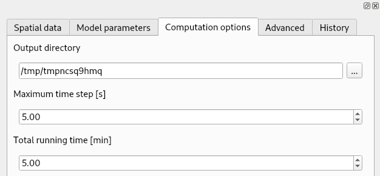

# Installation and Usage

SMODERP has been adapted to work seamlessly with various Geographic
Information System (GIS) platforms. Instalation for **QGIS**
(<https://qgis.org/>), **GRASS GIS** (<https://grass.osgeo.org/>), and
**ArcGIS Pro**
(<https://www.esri.com/en-us/arcgis/products/arcgis-pro/overview>) is
decribed below.

## QGIS Plugin

In QGIS, the plugin repository is a central storage location where
users can access and manage plugins that extend the functionality of
the QGIS application. SMODERP2D may be acessed from this repository.

### Installation instructions

* Install QGIS: <https://www.qgis.org/en/site/forusers/download.html>
    * Suggested version: 3.34.10/3.38.2 or higher, see [known issues](#known-issues) for details

* Check button `Show also Experimental Plugins` in Plugin/Settings 


* Install **SMODERP2D** plugin from QGIS plugin repository


Open the plugin from the menu ``Plugins`` ➤ ``SMODERP2D`` or from the
toolbar .

### Usage

The plugin consists of four tabs:

- *Spatial data* for defining input spatial GIS layers


- *Model parameters* for defining input parameters


- *Computation options* for defining various options including target
  directory where computation results will be stored



- *Advanced* for defining advanced options


- History runs are stored in *History* tab


### Known issues

Only for QGIS 3.34.9/3.38.1 or lower: On MS Windows QGIS plugin may
suffer by poping-up windows when starting computation. It is caused by
a bug in GRASS 8.3. This issue can be solved by copying ``core.py``
file available from [GitHub
repository](https://raw.githubusercontent.com/storm-fsv-cvut/smoderp2d/master/bin/qgis/grass_patch/core.py)
to a GRASS target directory which is typically located in:

- ``C:\Program Files\QGIS 3.**.*\apps\grass\grass83\etc\python\grass\script`` in the case that QGIS has been installed by standalone installer, or
- ``C:\OSGeo4W\apps\grass\grass83\etc\python\grass\script`` in the case that QGIS has been installed by OSGeo4W network installer.

## GRASS GIS Addon

### Installation instructions

* Install GRASS GIS: <https://grass.osgeo.org/download/>
* Download latest SMODERP2D version: <https://github.com/storm-fsv-cvut/smoderp2d/releases>
* Install GRASS Addon: `g.extension extension=r.smoderp2d url=/path/to/smoderp2d/bin/grass/r.smoderp2d`
* Install SMODERP2D package: `python3 -m pip install smoderp2d`
* Launch GRASS Addon: `r.smoderp2d`

### Usage

GRASS Addon is organized into several tabs similar to the QGIS plugin:

- *Spatial data*


- *Model parameters*


- *Computation options*


- *Advanced*


Compared to the QGIS plugin, the GRASS addon has a few more tabs:

- *Optional* for GRASS-related global options


- *Command output* for messages printed by running command


- *Manual* for GRASS Addon documentation


## ArcGIS Pro Toolbox
In the ArcGIS environment are a toolboxes a collection of geoprocessing tools. SMODERP are developed as extend tolbox of the ArcGIS software.

### Installation instructions

* Download ArcGIS Pro: <https://pro.arcgis.com/en/pro-app/latest/get-started/download-arcgis-pro.htm>
* Download latest SMODERP2D version: <https://github.com/storm-fsv-cvut/smoderp2d/releases>
* Open ArcGIS Toolbox located in ``bin\arcgis\SMODERP2D.pyt``


### Usage

Screen of ArGIS Pro - SMODERP Toolbox


Computation options and Advanced menu


History runs are stored in **History** of ArcGIS Pro project.

## Batch processing

First, download SMODERP2D from GitHub repository
<https://github.com/storm-fsv-cvut/smoderp2d>.

Batch processing may be run as a single process or multiple processes
defined by a CSV file.

To run batch process GRASS GIS is required.

!!! note "Installation Note"

    Note that on MS Windows GRASS GIS is part of the QGIS
    installation. In this case there is no need to install GRASS GIS
    separately.

    You only need to adjust the installation path in 
    `tests/batch/init_windows_env.bat` file based on how QGIS is installed.

    - If QGIS is installed using QGIS standalone installator, set `INSTALL_DIR` where QGIS is installed, e.g.:
    ```
    set INSTALL_DIR=C:\Program Files\QGIS 3.36.2\
    ```
    
    - If QGIS is installed using OSGeo4W network installator, set `INSTALL_DIR` where OSGeo4W is installed, e.g.:
    ```
    set INSTALL_DIR=C:\OSGeo4W
    ```

    You may also need to adjust GRASS version (in example below GRASS
    8.3 is expected to be installed):
    ```
    set GRASS_VERSION=83
    ```

### Single process

Open `batch_process_single.bat` (or `batch_process_single_linux.sh` on
GNU/Linux) located in `tests/batch` directory and adjust input
parameters. Then run the script.

### Multiple processes

Multiple processes may be defined by a CSV file, for example see
`tests/batch/batch_process.csv` file.

!!! note

    If the content of the first cell starts with `#`, the process is skipped.

Adjust parameters in your CSV file and run `batch_process_csv.bat` (or
`batch_process_csv_linux.sh` on GNU/Linux) located in `tests/batch`
directory.

!!! tip

    Processes may be run in parallel. Number of workers is defined in
    the script:

    ```
     --workers 1
    ```

    Note that for parallel processing (ie. number of workers > 1)
    [Joblib](https://joblib.readthedocs.io/en/stable/) Python package
    is required. The package may be installed on Windows by
    `install_joblib_windows.bat` located in `tests/batch`.

    WARNING: parallel processing is experimental and may have various
    problems.
