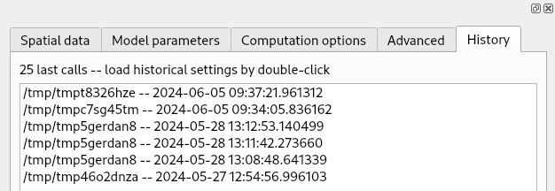

# Providers and install
## QGIS - Plugin

Lorem ipsum dolor sit amet, consectetur adipiscing elit. Duis vehicula tempus
nunc a vulputate. Cras mauris ligula, ultrices facilisis diam quis, condimentum
convallis magna. Duis bibendum sapien ac mi tristique volutpat. Morbi dolor mi,
commodo consectetur ligula id, laoreet porttitor sapien. Nam aliquet posuere ex
eget tincidunt. Praesent vehicula erat lorem. Pellentesque habitant morbi
tristique senectus et netus et malesuada fames ac turpis egestas. Aenean sit
amet elit ac velit placerat blandit dictum faucibus massa. Integer sed dui
lectus. Aenean non fermentum enim, sed molestie diam. Cras mollis euismod arcu.
Ut eu elit et eros aliquet elementum. Aenean semper, augue quis tempus dapibus,
felis ligula sodales justo, sit amet vulputate turpis velit a lorem. Morbi
auctor dignissim tincidunt. In hac habitasse platea dictumst. Morbi rhoncus
imperdiet purus quis scelerisque.

### Installation instructions

* Install QGIS: <https://www.qgis.org/en/site/forusers/download.html>
* Install **SMODERP2D** plugin from QGIS plugin repository

Open the plugin from the menu ``Plugins`` ➤ ``SMODERP2D`` or from the
toolbar .

### Usage

## GRASS GIS Addon

### Installation instructions

* Install GRASS GIS: <https://grass.osgeo.org/download/>
* Download latest SMODERP2D version: <https://github.com/storm-fsv-cvut/smoderp2d/releases>
* Open GRASS Addon located in ``bin/grass/r.smoderp2d/r.smoderp2d.py``

## ArcGIS Pro - Toolbox

Lorem ipsum dolor sit amet, consectetur adipiscing elit. Duis vehicula tempus
nunc a vulputate. Cras mauris ligula, ultrices facilisis diam quis, condimentum
convallis magna. Duis bibendum sapien ac mi tristique volutpat. Morbi dolor mi,
commodo consectetur ligula id, laoreet porttitor sapien. Nam aliquet posuere ex
eget tincidunt. Praesent vehicula erat lorem. Pellentesque habitant morbi
tristique senectus et netus et malesuada fames ac turpis egestas. Aenean sit
amet elit ac velit placerat blandit dictum faucibus massa. Integer sed dui
lectus. Aenean non fermentum enim, sed molestie diam. Cras mollis euismod arcu.
Ut eu elit et eros aliquet elementum. Aenean semper, augue quis tempus dapibus,
felis ligula sodales justo, sit amet vulputate turpis velit a lorem. Morbi
auctor dignissim tincidunt. In hac habitasse platea dictumst. Morbi rhoncus
imperdiet purus quis scelerisque.

### Installation instructions

* Download ArcGIS Pro: <https://pro.arcgis.com/en/pro-app/latest/get-started/download-arcgis-pro.htm>
* Download latest SMODERP2D version: <https://github.com/storm-fsv-cvut/smoderp2d/releases>
* Open ArcGIS Toolbox located in ``bin\arcgis\SMODERP2D.pyt``

